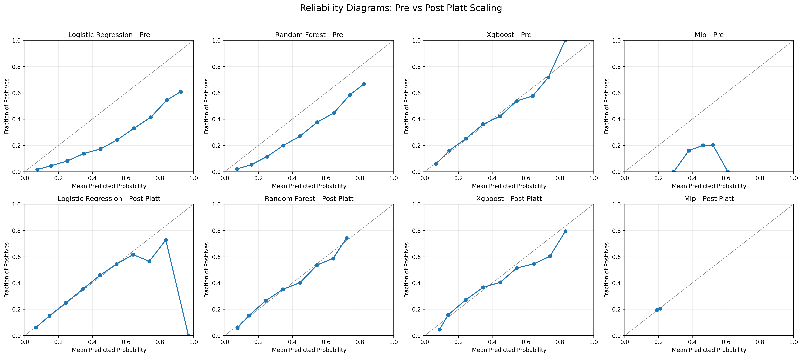
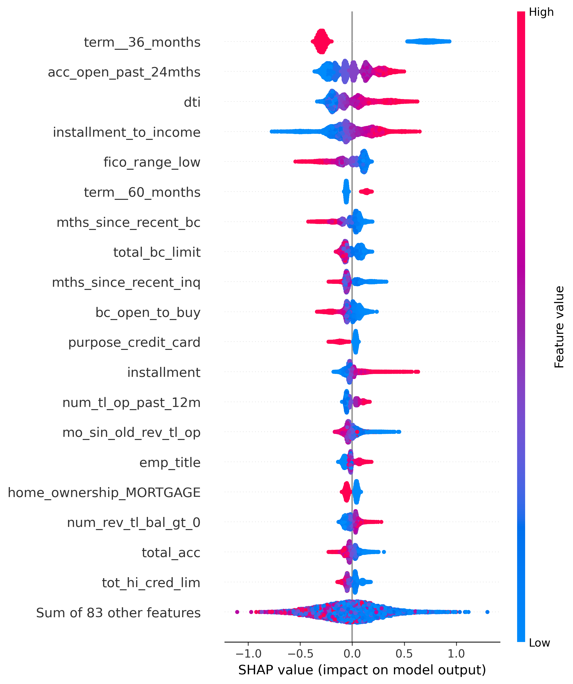

# Credit Risk PD Pipeline


End-to-end **probability-of-default (PD)** modeling on LendingClub loan data: preprocessing, supervised models (logistic regression, random forest, XGBoost), calibration, SHAP interpretability, portfolio simulation, and segment-level diagnostics.

Repository: [github.com/ARasugit20/CreditRisk_](https://github.com/ARasugit20/CreditRisk_)

## Architecture

```
lending_club_sample.csv
        │
        ▼  (scripts/load_to_duckdb.py)
DuckDB [raw.loans]
        │
        ▼  (dbt run)
┌─────────────────────────────────────────┐
│  staging/stg_loans                      │  ← clean + type-cast
│  core/dim_borrower                      │  ← borrower segments
│  core/fct_loan_performance              │  ← fact table
│  marts/mart_features          ◀── ML    │  ← model reads here
│  marts/mart_default_metrics             │  ← business KPIs
└─────────────────────────────────────────┘
        │
        ▼  (scripts/export_features.py)
data/mart_features.parquet
        │
        ▼
XGBoost + Platt calibration (src/)
```

**BQ-ready:** Replace DuckDB with BigQuery by updating `credit_risk_dbt/profiles.yml`.
dbt models are warehouse-agnostic SQL.

**Warehouse commands:**

```bash
pip install -r requirements.txt
python scripts/load_to_duckdb.py
cd credit_risk_dbt && dbt run --profiles-dir . && dbt test --profiles-dir . && cd ..
python scripts/export_features.py
```

## Executive Summary

**Business problem.** A lender must estimate the probability that a newly originated consumer loan will **charge off** (default) before maturity. Accurate PDs drive pricing (interest rates), portfolio limits, and expected-loss reserves.

**Target.** Binary default indicator from `loan_status`: **Charged Off = 1**, Fully Paid = 0. Non-terminal statuses are dropped at preprocessing.

**Approach.** Train-only sklearn pipelines (imputation, scaling, one-hot encoding), three classifiers tuned on **PR-AUC**, post-hoc **Platt calibration**, SHAP for global explainability, and **segment / temporal** experiments for robustness—not ad-hoc notebook steps.

**Holdout performance (XGBoost, stratified random split):**

| Model | ROC AUC | PR AUC | Brier | ECE |
|-------|---------|--------|-------|-----|
| XGBoost | 0.738 | 0.417 | 0.141 | 0.014 |
| Random Forest | 0.736 | 0.413 | 0.141 | 0.014 |
| Logistic Regression | 0.734 | 0.414 | 0.205 | 0.243 |

Full tables: `results/test_metrics.csv`, `results/metrics.json`.

**What drives default (SHAP, XGBoost).** The three strongest signals are **loan term** (36 vs 60 months—longer terms carry higher PD), **recent credit activity** (`acc_open_past_24mths`), and **debt-to-income (`dti`)**. Together they capture affordability and recent credit-seeking behavior beyond raw FICO alone. See `outputs/shap_feature_importance.csv` and the pinned summary plot below.

**Key figures**

| Figure | Description |
|--------|-------------|
|  | Calibrated predicted vs observed default rates by model |
|  | Global feature impact on PD (XGBoost) |

Interview talking points (PD vs LGD, PR-AUC, calibration, temporal splits, fairness): **[docs/INTERVIEW.md](docs/INTERVIEW.md)**.

Model documentation: **[docs/MODEL_CARD.md](docs/MODEL_CARD.md)**.

## Branch History

All work from `feature/pd-enhancements-modular-analytics` is **merged into `main`** (PRs #1 and #2). That branch added modular analytics (`pipeline.py`, `segment_analysis.py`, `nlp_analysis.py`, `compare_experiments.py`, train-only preprocessing artifacts). **`main` is the single source of truth**—no separate feature branch is required to reproduce results.

## What This Project Does

| Stage | Module | Purpose |
|-------|--------|---------|
| Preprocess | `src/preprocessing.py`, `src/pipeline.py` | Filter targets, engineer features, sklearn `Pipeline` + `ColumnTransformer`, train-only fit |
| Train | `src/train.py` | Baseline + tree/boosted models |
| Tune | `src/tune.py` | `GridSearchCV` with average precision; learning curves |
| Evaluate | `src/evaluate.py` | ROC AUC, PR AUC, Brier, ECE, bootstrap CIs |
| Calibrate | `src/calibration.py`, `src/reliability_diagrams.py` | Platt scaling, reliability diagrams |
| Explain | `src/shap_analysis.py` | SHAP summary, importance, dependence |
| Segment | `src/segment_analysis.py` | Performance by grade and loan purpose |
| NLP | `src/nlp_analysis.py` | Borrower text frequencies (charged-off vs paid) |
| Explore | `notebooks/eda.ipynb`, `notebooks/results_summary.ipynb` | EDA and output dashboard |

## Data Sources

| File | Label | Notes |
|------|-------|-------|
| `data/lending_club_sample.csv` | **Real** (demo subset) | ~100k-row reservoir sample shipped for reproducibility |
| `data/accepted_2007_to_2018Q4.csv` | **Real** (full Kaggle) | **Gitignored** — download locally; never commit |
| `tests/conftest.py` fixtures | **Synthetic** | Tiny frames for CI leakage tests only |

Do not commit Kaggle credentials or the full raw LendingClub CSV.

## Data Setup

**Raw data:** `data/lending_club_sample.csv` is included (~71MB, real LendingClub reservoir sample).

**Processed splits** (`processed_*.csv`, `temporal_processed_*.csv`) are **not** stored in git — regenerate locally:

```bash
pip install -r requirements.txt
bash scripts/run_full_analysis.sh
```

Or preprocess only:

```bash
python src/preprocessing.py
# Temporal robustness split:
python src/preprocessing.py --split-strategy temporal --train-end-date 2015-12-31 --validation-end-date 2016-12-31 --output-prefix temporal_
```

## Quick Start (developers)

```bash
pip install -r requirements.txt
python -m nltk.downloader punkt stopwords   # first run only, for nlp_analysis.py
bash scripts/run_full_analysis.sh
```

The runner **fails fast** if `data/` is missing or contains no usable CSV, with instructions to add local data.

Or step-by-step:

```bash
pip install -r requirements.txt
python src/sample_data.py --mode random --rows 100000
python src/preprocessing.py
python src/train.py --include-xgboost
python src/tune.py
MPLBACKEND=Agg python src/evaluate.py
MPLBACKEND=Agg python src/calibration.py
MPLBACKEND=Agg python src/reliability_diagrams.py
MPLBACKEND=Agg python src/portfolio_simulation.py
MPLBACKEND=Agg python src/shap_analysis.py
python src/segment_analysis.py
python src/nlp_analysis.py
MPLBACKEND=Agg python src/ablation.py --train-sample-size 0
python src/compare_experiments.py
```

## CI

GitHub Actions (`.github/workflows/ci.yml`) runs **ruff** on `src/` and `tests/`, and **pytest** on `tests/` (including leakage checks in `tests/test_no_leakage.py`).

```bash
pip install pytest ruff
ruff check src tests
pytest tests/ -v
```

## Expected Files

Place the Kaggle LendingClub accepted-loans CSV under `data/` and saved model artifacts under `models/`.

Default data names searched:

- `data/processed_train.csv` and `data/processed_test.csv`
- raw sample input: `data/accepted_2007_to_2018Q4.csv`
- generated sample: `data/lending_club_sample.csv` (default input to `preprocessing.py`, matching `sample_data.py` output)

**Data directory layout:** Keep CSVs directly under the project `data/` folder. Do not nest another project tree inside `data/`.

Default model artifact names searched:

- Logistic regression: `logistic_regression.pkl`, `logreg.pkl`, `lr_model.pkl`
- Random forest: `random_forest.pkl`, `rf.pkl`, `rf_model.pkl`
- XGBoost: `xgboost.pkl`, `xgb.pkl`, `xgb_model.pkl`, `xgboost.json`
- MLP: `mlp.pkl`, `mlp_model.pkl`, `neural_network.pkl`

The preprocessing script filters `loan_status` to Fully Paid / Charged Off, drops leakage features, imputes and encodes features, and creates stratified 70/15/15 splits (or optional temporal splits by `issue_d`).

## New Module Outputs (`outputs/`)

| Artifact | Produced by |
|----------|-------------|
| `learning_curves.png` | `src/tune.py` |
| `segment_performance.csv` | `src/segment_analysis.py` |
| `segment_calibration_by_grade.png` | `src/segment_analysis.py` |
| `nlp_top_words.png`, `nlp_top_bigrams.png` | `src/nlp_analysis.py` |
| `reliability_diagrams.png`, `shap_*.png` | existing analysis modules |

Serialized preprocessing artifact: `models/preprocessing_pipeline.pkl` (gitignored; regenerate via `preprocessing.py`).

## Temporal Robustness Experiment

```bash
python src/preprocessing.py --split-strategy temporal --train-end-date 2015-12-31 --validation-end-date 2016-12-31 --output-prefix temporal_
python src/train.py --include-xgboost --train-path data/temporal_processed_train.csv --validation-path data/temporal_processed_validation.csv --model-suffix _temporal --results-prefix temporal_
MPLBACKEND=Agg python src/evaluate.py --test-path data/temporal_processed_test.csv --model-suffix _temporal --results-prefix temporal_ --bootstrap-samples 200
python src/compare_experiments.py
```

## Knowledge Sources & Implementation Map

This project applies techniques from **Fabio Nelli**, *Python Data Analytics: With Pandas, NumPy, and Matplotlib* (2nd ed., Apress, 2018), accessed via [Skillsoft](https://www.skillsoft.com/book/python-data-analytics-with-pandas-numpy-and-matplotlib-second-edition-52ebe53b-efba-4688-a70d-c3c333b6aa36).

| Book chapter (Nelli, 2nd ed.) | Technique | Where used in this repo |
|-------------------------------|-----------|-------------------------|
| **Ch 6 — Pandas in Depth: Data Manipulation** | `groupby`, aggregations, pivot tables, method chaining | `notebooks/eda.ipynb`, `src/segment_analysis.py` |
| **Ch 7 — Data Visualization with Matplotlib** | Custom `rcParams`, multi-panel figures | `src/plot_style.py`, `src/segment_analysis.py`, `src/tune.py`, `src/nlp_analysis.py` |
| **Ch 13 — Textual Data Analysis with NLTK** | Tokenization, `FreqDist`, bigrams | `src/nlp_analysis.py` |
| **Ch 3 — The NumPy Library** | Vectorized numeric transforms (`log1p`, array ops) | `src/preprocessing.py` (`add_engineered_features`) |
| **Ch 8 — Machine Learning with Scikit-Learn** | Pipelines, `ColumnTransformer`, `GridSearchCV` | `src/pipeline.py`, `src/tune.py`, `src/calibration.py` |

### Citation (APA)

> Nelli, F. (2018). *Python data analytics: With Pandas, NumPy, and Matplotlib* (2nd ed.). Apress. https://www.skillsoft.com/book/python-data-analytics-with-pandas-numpy-and-matplotlib-second-edition-52ebe53b-efba-4688-a70d-c3c333b6aa36

Additional references used in the modeling stack:

- Lundberg, S. M., & Lee, S.-I. (2017). A unified approach to interpreting model predictions (SHAP). *NeurIPS*.
- scikit-learn documentation: probability calibration (`CalibratedClassifierCV`), `learning_curve`, stratified cross-validation.

## Dependencies

See `requirements.txt`. New library for text analysis: **`nltk>=3.8`**.
